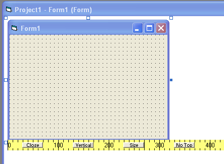



## Pixel Ruler

### Description

Pixel Ruler allows you to quickly measure forms and screen objects in pixels.
 
### More Info
 
By default the application stays on top of all other forms, but this can be toggled with a button. It displays either vertically or horizontally with another button.

             |
---                |---
**Submitted On**   |2004-12-03 14:38:50
**By**             |[Wunder](https://github.com/Planet-Source-Code/PSCIndex/blob/master/ByAuthor/wunder.md)
**Level**          |Beginner
**User Rating**    |4.8 (29 globes from 6 users)
**Compatibility**  |VB 6\.0
**Category**       |[Complete Applications](https://github.com/Planet-Source-Code/PSCIndex/blob/master/ByCategory/complete-applications__1-27.md)
**World**          |[Visual Basic](https://github.com/Planet-Source-Code/PSCIndex/blob/master/ByWorld/visual-basic.md)
**Archive File**   |[Pixel\_Rule19506211232005\.zip](https://github.com/Planet-Source-Code/wunder-pixel-ruler__1-63348/archive/master.zip)

